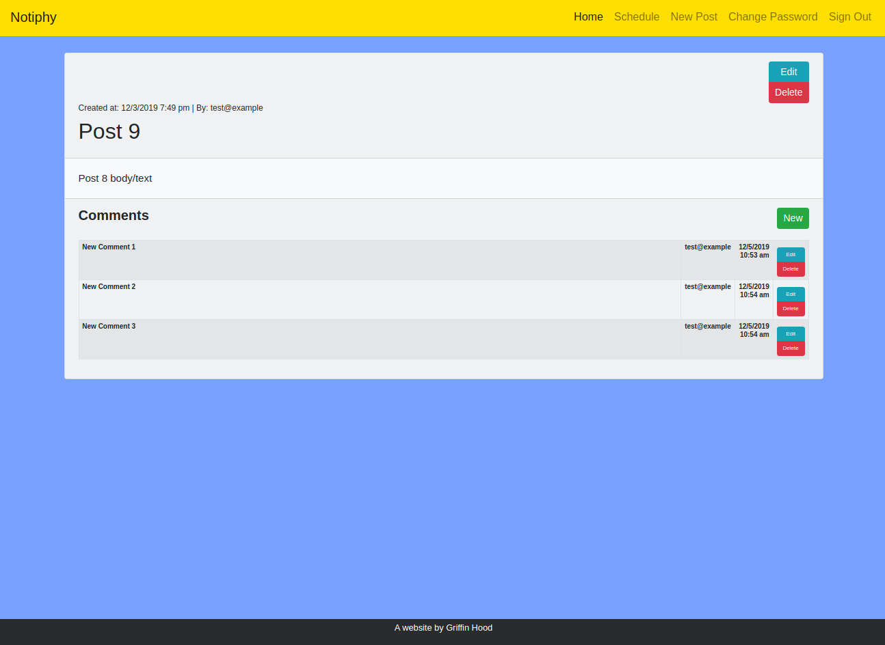
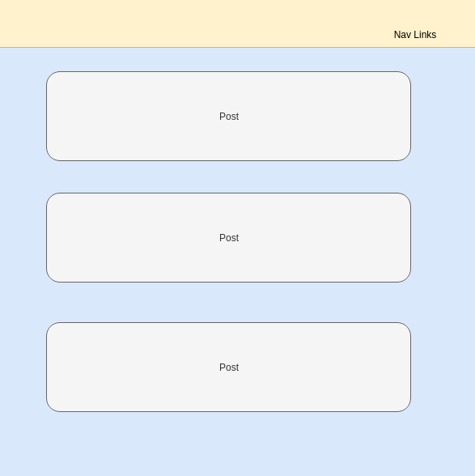
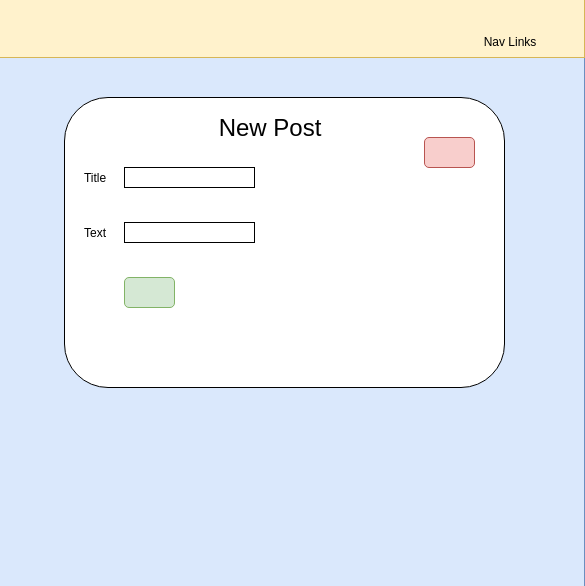
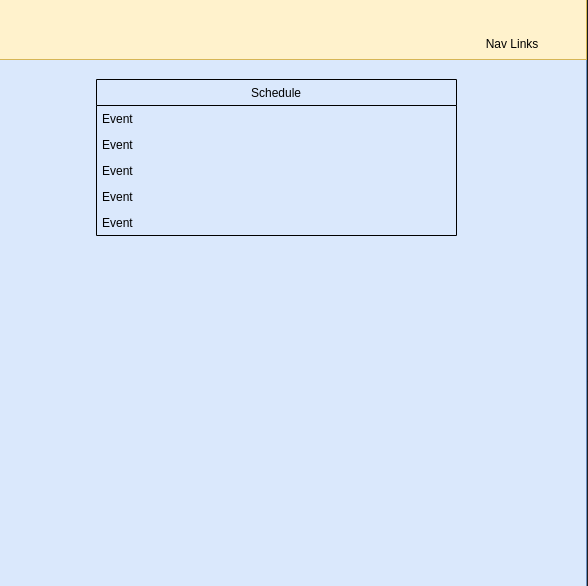

# TeamNotiphy client

This application allows sports teams to communicate with each other and with other members of the organization. You can also keep track of your record and upcoming events. The inspiration for this project came from the Needham High School wrestling team. As a coach of this team, I have been searching for a better way to communicate with the athletes and their parents. I couldn't find one so I made my own!

## Links

- [Back-end Repo](https://github.com/ghood97/TeamNotiphy-api)
- [Deployed API](https://team-notiphy-api.herokuapp.com/)
- [Deployed Client](https://ghood97.github.io/TeamNotiphy-client/)

## Setup Steps

1. [Fork and clone](https://git.generalassemb.ly/ga-wdi-boston/meta/wiki/ForkAndClone) this repository.
1. Run `npm install` to install all dependencies
1. Use `npm run start` to spin up the server.

## Planning

After the idea came to me, I decided I was going to use Ruby on Rails and PostgreSQL for my backend because all of my resources would be related to each other. I diagrammed my entity relationships and started to build my back end. Once the back end was done, I started to build the React front end. I drew out wireframes of all of the different views that the app would have. I started with the smallest components first and worked up to bigger components that would nest the smaller ones.

### User Stories

- As a user, I want to be able to sign-up.
- As a user, I want to be able to sign-in.
- As a user, I want to be able to sign-out.
- As a user, I want to be able to change my password.
- As an unauthenticated user, I want to be able to see all posts.
- As an unauthenticated user, I want to be able to see all events.
- As an authenticated user, I want to be able to view all comments for all posts.
- As an authenticated user, I want to be able to edit or delete the posts and comments and events that I own.

### Technologies Used

- HTML/CSS
- JavaScript
- React
- React-Bootstrap

### Catalog of Routes
### **Post**
Verb         |	URI Pattern
------------ | -------------
GET | /posts
GET | /posts/:id
POST | /posts
PATCH | /posts/:id
DELETE | /posts/:id

### **Comment**
Verb         |	URI Pattern
------------ | -------------
GET | /comments
GET | /comments/:id
POST | /comments
PATCH | /comments/:id
DELETE | /comments/:id

### **Event**
Verb         |	URI Pattern
------------ | -------------
GET | /events
GET | /events/:id
POST | /events
PATCH | /events/:id
DELETE | /events/:id

### Unsolved Problems

- I would like to find a visually more appealing calendar package.
- I would like to utilize a third-party api to get relative sports news

## App Screenshot:

---

## Wireframes:

